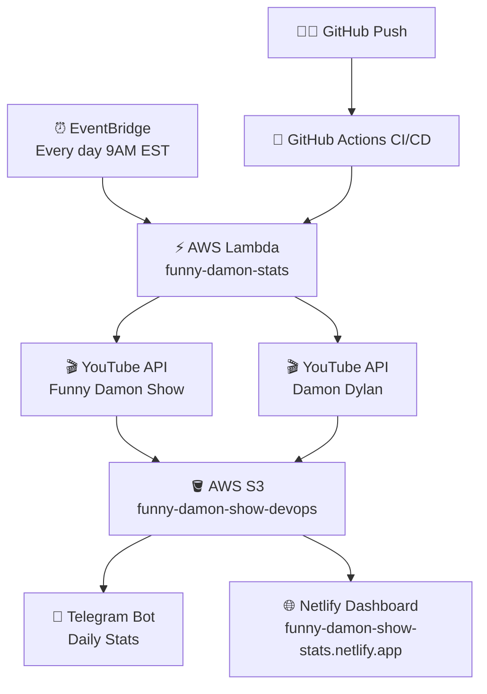

# 📊 YouTube Analytics Pipeline

Automated YouTube channel analytics system built with AWS and Python.

## 🔗 Live Dashboard
[funny-damon-show-stats.netlify.app](https://funny-damon-show-stats.netlify.app)

## 📋 Overview
This project automatically collects YouTube statistics for two channels daily and delivers them via Telegram bot and a public web dashboard.

## 🏗️ Architecture

## 📦 Features
- Monitors 2 YouTube channels: Funny Damon Show & Damon Dylan
- Runs automatically every day at 9:00 AM
- Stores historical data in S3
- Sends daily Telegram message with stats
- Public web dashboard with live data

## 🚀 How It Works
1. EventBridge triggers Lambda every day at 9:00 AM EST
2. Lambda fetches stats from YouTube Data API v3
3. Stats saved to S3 as JSON files
4. Telegram bot sends formatted message
5. Dashboard reads from S3 and displays stats

## 📁 Project Structure
- `lambda_function.py` — main Lambda handler
- `dashboard.py` — generates HTML dashboard from S3 data
- `index.html` — web dashboard (auto-deployed to Netlify)
- `youtube_stats.py` — local stats script
- `telegram_bot.py` — local Telegram script

## 👩‍💻 Author
Marta Dzekevich — DevOps Engineer
GitHub: github.com/Marta77784
